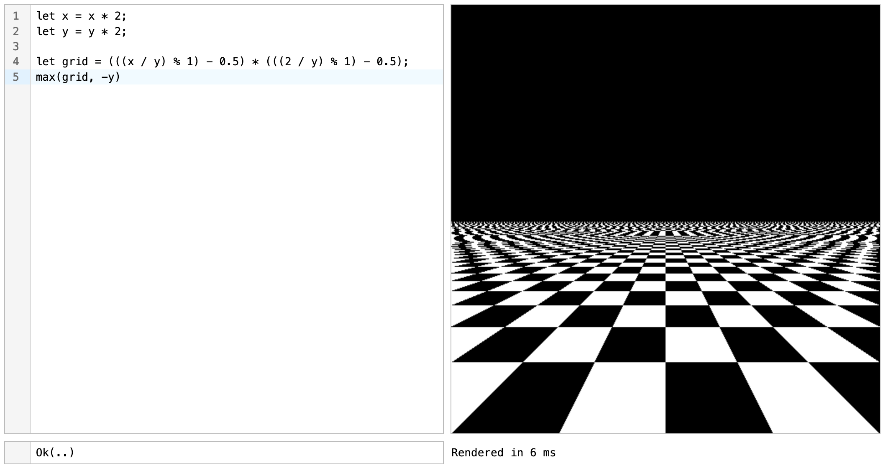

# Fidget

[Project writeup](https://mattkeeter.com/projects/fidget) | [Demo](https://mattkeeter.com/projects/fidget/demo)

Fidget is experimental infrastructure for complex closed-form implicit surfaces.

The library contains a variety of data structures and algorithms, e.g.

- Manipulation and deduplication of math expressions
- Conversion from graphs into straight-line code ("tapes") for evaluation
- Tape simplification, based on interval evaluation results
- A _very fast_ JIT compiler, with hand-written `aarch64` and `x86_64` routines
  for
    - Point-wise evaluation (`f32`)
    - Interval evaluation (`[lower, upper]`)
    - SIMD evaluation (`f32 x 4` on ARM, `f32 x 8` on x86)
    - Gradient evaluation (partial derivatives with respect to x, y, and z)
- Bitmap rendering of implicit surfaces in 2D (with a variety of rendering
  modes) and 3D (producing heightmaps and normals)
- Meshing (using our own implementation of the
  [Manifold Dual Contouring](https://people.engr.tamu.edu/schaefer/research/dualsimp_tvcg.pdf)
  algorithm)

If this all sounds oddly familiar, it's because you've read
[Massively Parallel Rendering of Complex Closed-Form Implicit Surfaces](https://www.mattkeeter.com/research/mpr/).
Fidget includes all of the building blocks from that paper, but with an emphasis
on (native) evaluation on the CPU, rather than (interpreted) evaluation on the
GPU.

The library has [extensive documentation](https://docs.rs/fidget/latest/fidget/),
including a high-level overview of the APIs in the crate-level docs; this is a
great place to get started!

At the moment, it has strong Lego-kit-without-a-manual energy: there are lots of
functions that are individually documented, but putting them together into
something useful is left as an exercise to the reader.  There may also be some
missing pieces, and the API seams may not be in the right places; if you're
doing serious work with the library, expect to fork it and make local
modifications.

Issues and PRs are welcome, although I'm unlikely to merge anything which adds
substantial maintenance burden.  This is a personal-scale experimental project,
so adjust your expectations accordingly.

## Demos
The [`demos` folder](demos/README.md) contains several demo tools and
applications built using the Fidget crate,
ranging from CLI to GUI to web app.

## Projects using Fidget
- [The Prospero Challenge](https://mattkeeter.com/projects/prospero) was
  designed around Fidget's rendering implementation, then opened up to
  third-party submissions
- [`rsaccon/fidget-koto`](https://github.com/rsaccon/fidget-koto): An adaptation
  of the `fidget-viewer` demo using [Koto](https://koto.dev/) for scripting
  (instead of [Rhai](https://rhai.rs))
- [`alexneufeld/fidgetpy`](https://github.com/alexneufeld/fidgetpy): Python
  bindings and high-level API

## Support matrix
At the moment, Fidget supports a limited number of platforms:

| Platform                    | JIT support | CI         | Support   |
|-----------------------------|-------------|------------|-----------|
| `aarch64-apple-darwin`      | Yes         | ✅ Tested  | ⭐️ Tier 0 |
| `x86_64-unknown-linux-gnu`  | Yes         | ✅ Tested  | 🥇 Tier 1 |
| `x86_64-pc-windows-msvc`    | Yes         | ✅ Tested  | 🥈 Tier 2 |
| `aarch64-unknown-linux-gnu` | Yes         | ⚠️  Checked | 🥇 Tier 1 |
| `aarch64-pc-windows-msvc`   | Yes         | ⚠️  Checked | 🥉 Tier 3 |
| `wasm32-unknown-unknown`    | No          | ⚠️  Checked | 🥇 Tier 1 |

### Explanation of keys
| CI         | Description                               |
|------------|-------------------------------------------|
| ✅ Tested  | `cargo test` is run for the given target  |
| ⚠️  Checked | `cargo check` is run for the given target |

| Tier      | Description                                                                    |
|-----------|--------------------------------------------------------------------------------|
| ⭐️ Tier 0 | A maintainer uses this platform as their daily driver                          |
| 🥇 Tier 1 | A maintainer has access to this platform                                       |
| 🥈 Tier 2 | A maintainer does not have access to this platform, but it is tested in CI     |
| 🥉 Tier 3 | A maintainer does not have access to this platform, and it is not tested in CI |

Support tiers represent whether maintainers will be able to help with
platform-specific bugs; for example, if you discover an
`aarch64-pc-windows-msvc`-specific issue, expect to do most of the heavy lifting
yourself.

### CPU requirements
`aarch64` platforms require NEON instructions and `x86_64` platforms require
AVX2 support; both of these extensions are nearly a decade old and should be
widespread.

Disabling the `jit` feature allows for cross-platform rendering, using an
interpreter rather than JIT compilation.  This is mandatory for the
`wasm32-unknown-unknown` target, which cannot generate "native" code.

## Similar projects
Fidget overlaps with various projects in the implicit modeling space:

- [kokopelli: script-based CAD/CAM in Python](https://mattkeeter.com/projects/kokopelli)*
- [Antimony: CAD from a parallel universe](https://mattkeeter.com/projects/antimony)*
- [`libfive`: Infrastructure for solid modeling](https://libfive.com)*
- [Massively Parallel Rendering of Complex Closed-Form Implicit Surfaces (MPR)](https://github.com/mkeeter/mpr)*
- [ImplicitCAD: Powerful, Open-Source, Programmatic CAD](https://implicitcad.org/)
- [Ruckus: Procedural CAD For Weirdos](https://docs.racket-lang.org/ruckus/index.html)
- [Curv: a language for making art using mathematics](https://github.com/curv3d/curv)
- [sdf: Simple SDF mesh generation in Python](https://github.com/fogleman/sdf)
- [Forged Thoughts: A Modeling & Rendering Language in Rust](https://forgedthoughts.com/)
- [Raumkuenstler: Node-based modeling with an LLVM-powered JIT compiler](https://github.com/elisabeth96/Raumkuenstler)
- [`saft_sdf`: Signed distance field function utilities and interpreter](https://docs.rs/saft-sdf/0.2.1/saft_sdf/)
- Probably more; PRs welcome!

*written by the same author

(the MPR paper also cites
[many references](https://dl.acm.org/doi/10.1145/3386569.3392429#sec-ref)
to related academic work)

Compared to these projects, Fidget is unique in having a native JIT **and**
using that JIT while performing tape simplification.  Situating it among
projects by the same author – which all use roughly the same rendering
strategies – it looks something like this:

|                 | CPU               | GPU
|-----------------|-------------------|------
| **Interpreter** | `libfive`, Fidget | MPR
| **JIT**         | Fidget            | (please give me APIs to do this)

Fidget's native JIT makes it _blazing fast_.
For example, here are rough benchmarks rasterizing [this model](https://www.mattkeeter.com/projects/siggraph/depth_norm@2x.png)
across three different implementations:

Size  | `libfive` | MPR     | Fidget (VM) | Fidget (JIT)
------|-----------|---------|-------------|---------------
1024³ | 66.8 ms   | 22.6 ms | 61.7 ms     | 23.6 ms
1536³ | 127 ms    | 39.3 ms | 112 ms      | 45.4 ms
2048³ | 211 ms    | 60.6 ms | 184 ms      | 77.4 ms

`libfive` and Fidget are running on an M1 Max CPU; MPR is running on a GTX 1080
Ti GPU.  We see that Fidget's interpreter is slightly better than `libfive`, and
Fidget's JIT is _nearly_ competitive with the GPU-based MPR.

Fidget is missing a bunch of features that are found in more mature projects.
For example, it only includes a debug GUI, and its meshing is much less
battle-tested than `libfive`.

## License
© 2022-2025 Matthew Keeter  
Released under the [Mozilla Public License 2.0](https://github.com/mkeeter/fidget/blob/main/LICENSE.txt)
