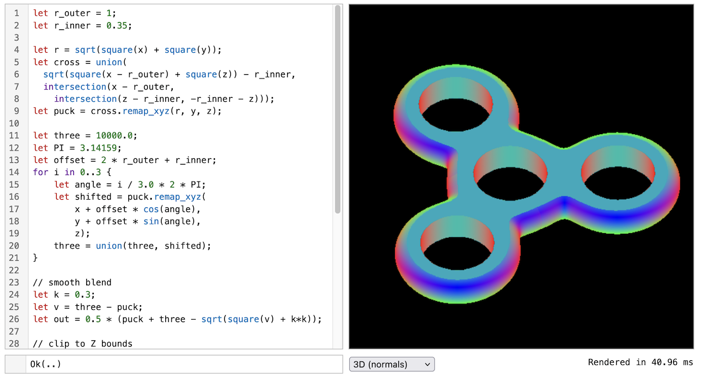

# Fidget demos
## Custom command-line demo ([`basic`](basic/))

Same as cli but with added camera controls and a bit of refactoring.

## Command-line demo ([`cli`](cli/))

Bitmap rendering and meshing from the command line
```shell
$ cargo run -pfidget-cli --release -- -i models/prospero.vm render2d -s 512 --eval=vm -o out.png
    Finished release [optimized + debuginfo] target(s) in 0.07s
     Running `target/release/fidget-cli -i models/prospero.vm render2d -s 512 --eval=vm -o out.png`
[2024-06-06T16:08:12Z INFO  fidget_cli] Loaded file in 4.528208ms
[2024-06-06T16:08:12Z INFO  fidget_cli] Built shape in 2.375208ms
[2024-06-06T16:08:12Z INFO  fidget_cli] Rendered 1x at 14.489 ms/frame
```

## Script viewer ([`viewer`](viewer/))
Minimal desktop GUI for interactive exploration,
using [`egui`](https://github.com/emilk/egui)

```shell
cargo run --release -pfidget-viewer
```


## Constraint solving ([`constraints`](constraints/))
Example of using Fidget for constraint solving.
Uses [`egui`](https://github.com/emilk/egui)
and runs either on the desktop or as a web app.
```shell
cargo run --release -pconstraints
```


See the [subfolder](constraints/) for details on bundling for the web.

## Web-based editor ([`web-editor`](web-editor/))
Integrates Fidget into a TypeScript project (web only)



See the [subfolder](web-editor/) for details on bundling for the web.
